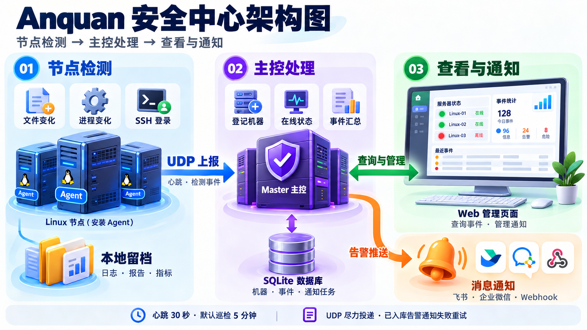
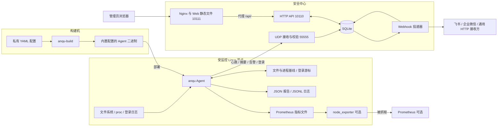
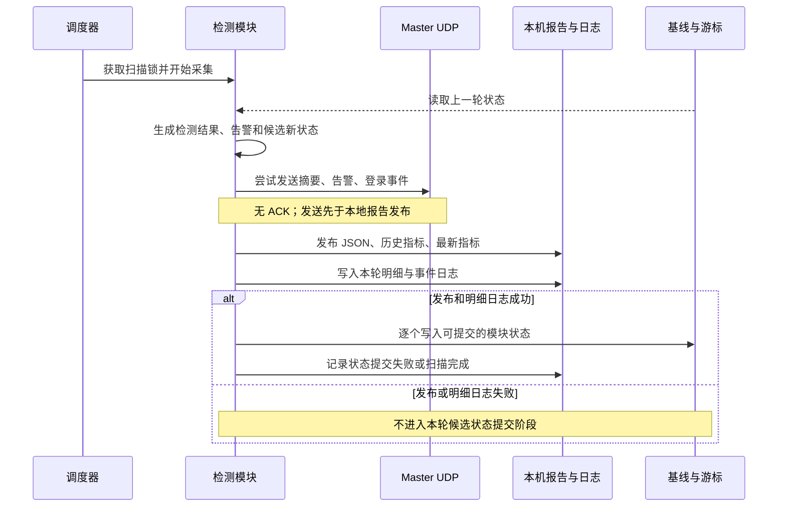
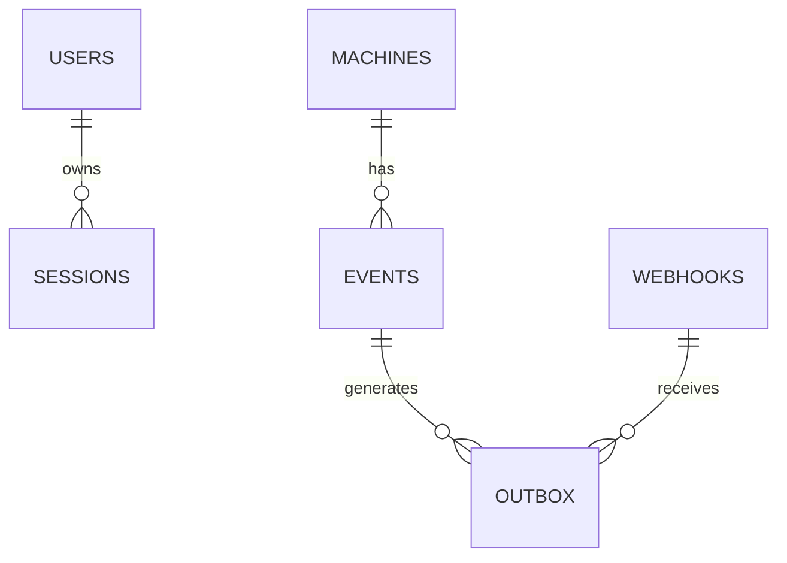

# Anquan 安全中心架构设计

本文面向开发、运维与系统维护人员，说明 Anquan 安全中心的组件职责、运行流程、数据存储、部署关系及实现边界。系统由 Linux 节点 Agent、Go Master 主控和 Vue Web 前端组成，用于发现文件与进程变化、记录 SSH 成功登录，并集中展示和通知。

文档日期：2026 年 10 月 5 日。内容依据当前工作区源码；后续演进建议单独列出，不代表已经实现。

## 架构范围与代码基线

| 组件 | 工作区位置 | 源码基线 | 主要职责 |
|---|---|---|---|
| Agent | 根目录，独立仓库 `anquan` | `8b3c9c9`，程序版本 `0.4.0` | 本机检测、状态保存、日志和指标输出、事件上报 |
| Master | `anquan-server-master/` | `5e58bf8` | UDP 接收、机器登记、事件存储、管理 API、Webhook 投递 |
| Web | `anquan-server-web/` | `db56ff9`，包版本 `1.0.0` | 登录、概览、机器与事件管理、通知配置 |

三个目录属于独立 Git 仓库。根仓库通过 `.gitignore` 排除 Master 和 Web 子目录，它们不是根仓库内的 Go 子包或 Git 子模块。本文中子仓库源码链接按当前工作区布局编写。

当前系统覆盖周期巡检、集中查询和告警通知。Agent 没有远程命令执行、主控配置下发或自动修复接口；Web 中的事件“已处理”是管理状态，不会改变目标节点上的文件或进程。

## 总体架构



彩色图用于快速理解主要流程，屏幕中的统计数字为插画示意。下方组件图补充构建机、可选指标采集及服务连接关系。



Master 的 UDP 接收器、HTTP API 和通知投递器运行于同一个 Go 进程。SQLite 保存业务数据及通知队列；没有独立消息中间件或数据库服务。Web 由 Nginx 提供静态资源，通过同源 `/api/` 代理访问 Master。

Agent 可以配置多个 Master 地址，分别发送事件。这是独立上报，不包含主控间复制、主从切换或数据一致性协调。`server: []` 时 Agent 完整执行本机检测，关闭网络上报。

## 技术栈与模块划分

版本为当前源码声明，不表示软件的最新发行版本。

| 层次 | 技术与依赖 | 组织方式 |
|---|---|---|
| Agent | Go `1.22`；`go.yaml.in/yaml/v3 v3.0.4` | 命令入口、配置封装、检测与输出模块 |
| Master | `go.mod` 声明 Go `1.27.1`；标准库 `net/http`；`modernc.org/sqlite v1.60.1`；bcrypt | 单进程服务与 SQLite 数据访问层 |
| Web | Vue `^3.5.13`、TypeScript `~5.7.2`、Vite `^6.3.5`、Lucide 图标 | Composition API、本地响应式状态、统一 fetch 封装 |
| 构建与部署 | Web 容器构建使用 Node.js 24、pnpm `11.19.0`；Nginx、Docker Compose、systemd | 主控与前端支持容器或原生部署 |
| 可观测性 | JSON/JSONL、Prometheus textfile、systemd journal | Agent 本机记录为检测明细来源 |

```text
安全防护/
├── cmd/anqu/                  Agent 运行入口
├── cmd/anqu-build/            配置校验与专用构建器
├── internal/sealed/           AES-GCM 配置封装与读取
├── internal/audit/            采集、规则判断、状态、输出与 UDP 上报
├── configs/                   配置示例
├── deploy/                    Agent systemd 单元
├── docs/                      架构、部署、协议及需求说明
├── anquan-server-master/
│   ├── cmd/anquan-master/     主控启动与密码重置入口
│   ├── internal/server/       接收、存储、鉴权、API、通知
│   ├── deploy/                原生部署与容器辅助脚本
│   └── compose.yaml           主控与前端容器编排
└── anquan-server-web/
    ├── src/App.vue            页面、状态与交互编排
    ├── src/api.ts             HTTP 调用与错误处理
    ├── src/types.ts           接口数据类型
    ├── src/event-labels.ts    事件中文展示
    ├── src/components/        分页组件
    └── nginx.conf             静态资源与 API 代理
```

## Agent 架构

### 配置与构建

构建机读取私有 YAML，校验字段、规则和目标系统路径格式，随后使用随机 32 字节密钥和随机 nonce，通过 AES-256-GCM 封装配置。构建器使用 Go overlay 将密钥和密文嵌入可执行文件，生成内容与配置相关的编译缓存放在临时目录。

节点启动后在内存中解密、解析配置；相对路径以可执行程序目录为基准。节点命令行只提供运行模式、版本和帮助，不读取旁边的 YAML。修改监控范围、主控地址或 `agent_ip` 后，需要重新构建和替换二进制。普通 `go build ./cmd/anqu` 生成的程序没有内置配置。

这种方式减少明文配置分发，但密钥与密文同时存在于程序中，本机管理员仍可能恢复配置。它不构成对节点管理员的保密边界，也不提供程序签名或远程可信证明。

### 调度与生命周期

| 模式 | 行为 | 使用场景 |
|---|---|---|
| 无参数 | 启动心跳后执行一轮并退出 | 验证、手工巡检、外部调度 |
| `-service` | 启动心跳、立即巡检、按配置周期继续执行 | 持续监控与在线状态维护 |
| systemd timer | 定时调用 oneshot 单元 | 可选外部调度方式，与常驻服务择一使用 |

默认巡检周期为 300 秒，可配置为 1–86400 秒。巡检在一个执行循环内串行运行，不重叠扫描；扫描耗时超过周期时，不保证保留每一个定时节拍。常驻模式另起 goroutine，每 30 秒发送心跳，避免慢扫描阻塞在线状态更新。

服务级锁和扫描级锁基于状态文件路径，防止相同状态文件被重复实例并发处理。常驻模式记录单轮错误并继续后续巡检；收到停止信号后不再安排下一轮，当前扫描结束后退出。文件遍历并没有统一的全轮超时承诺。

单次执行退出码：`0` 表示采集成功且没有告警，`2` 表示采集成功但检测到告警，`1` 表示配置、采集、输出等执行失败。常驻服务中的单轮告警不会直接终止进程。

### 检测模块

| 模块 | 输入与算法 | 持久状态 | 关键语义 |
|---|---|---|---|
| 文件监控 | 显式路径、目录递归、按文件名搜索；逐文件计算 MD5 | `.files` 基线 | 无指定 MD5 时比较上轮；有指定 MD5 时匹配允许集合 |
| 进程监控 | 读取 Linux `/proc`，按规范化后的完整命令与实例数比较 | `.processes` 基线 | 必须存在规则支持 OR；白名单只抑制清单增删告警 |
| SSH 登录 | journal、authlog、jsonl、wtmp 四类来源 | `.logins` 游标与去重状态 | 逐条记录成功登录，保留发生时间、来源 IP、用户和终端 |
| 旧版兼容 | `md5` 和 `existence` 配置 | 原始 `state_file` 等 | 新监控配置仍保留旧格式解析与执行兼容 |

文件滚动模式首次成功扫描建立基线，后续报告新增、修改和删除，再推进基线，因此一次内容修改通常在发现轮次告警。固定 MD5 允许集合不会自动学习异常值，持续不匹配会持续告警。重命名体现为删除加新增；仅权限、属主或时间戳变化不属于内容变化。

扫描不完整时保留该模块旧基线，避免将不可读取的文件或进程误判为删除。符号链接和特殊文件不参与普通文件 MD5 比较，目录链接不递归进入；Agent 自己的状态、日志和输出路径被排除。

文件基线保存监控范围摘要，进程基线保存清单配置摘要。更改文件规则或进程白名单后，旧状态可能因范围不匹配被拒绝；应备份并显式迁移相关状态，再初始化新基线。仅替换带新配置的二进制不会自动接受不兼容的旧基线。

进程规则按完整命令精确匹配，不是关键字子串匹配。相同命令的实例数量变化也会产生清单变化。Agent 排除自己的 PID，正常退出的进程可跳过，权限和读取错误使本轮进程模块失败。进程监控的生产运行依赖 Linux。

SSH 默认生产来源为 journal：首次默认回看 24 小时，之后按持久化游标续读；默认每轮页上限为 1000，积压通过 `pending` 表示。authlog 可续读保留的未压缩轮转文件；JSONL 适合接入与演示；wtmp 的覆盖范围取决于系统是否记录该会话。已被系统删除的日志无法恢复，未知终端记录为 `N/A`。

### 单轮数据流与状态提交



关键顺序是“采集 → UDP 尝试发送 → 本地报告和指标发布 → 明细日志 → 模块状态提交”。UDP 上报不是在本地全部持久化之后发生，也不等待主控确认。

报告、指标和状态单文件使用临时文件、同步写入、重命名替换；多个输出和多个模块状态之间没有跨文件事务。部分状态提交成功后，后续模块仍可能提交失败。失败信息会尝试写回报告并记录日志，不回滚已经成功保存的模块状态。

UDP 失败被记录到本机报告并使本轮整体成功状态变为失败，但在本地发布成功后，已成功采集的模块仍可推进状态。因此下轮不会自动补发丢失的历史事件。已发送的摘要也不包含随后发生的 UDP、本地发布或状态提交错误。

### 本机输出

| 输出 | 默认或示例位置 | 用途 |
|---|---|---|
| 单轮 JSON | `/usr/local/anqu/<采集时间>.json` | 完整检测结果、告警与发送结果 |
| 每日 JSONL | `/var/log/<北京时间日期>anquan.log` | 生命周期、检测明细、告警与 SSH 登录 |
| 最新指标 | `/usr/local/anqu/textfile/anqu.prom` | `anqu_` 前缀，供当前状态告警查询 |
| 历史指标 | `/var/lib/node_exporter/textfile_collector/<采集时间>process_monitor.prom` | 新监控模式使用 `anqu_snapshot_` 前缀以及 `host`、`run_id` 标签 |
| 基线与游标 | `/usr/local/anqu/state/md5.json` 及其后缀文件 | 检测对比、登录续读与去重 |

报告与日志默认文件权限为 `0640`，状态为 `0600`，指标为 `0644`。日志文件名按北京时间日期切换；报告时区由配置控制。Master 保存 UTC 时间，浏览器按本地时区显示，排查时应比较时间值而非直接比较显示文本。

Agent 仅写 Prometheus textfile，不监听指标 HTTP 端口。node_exporter 和 Prometheus 是可选外部组件，需要独立部署。历史报告、指标和日志没有自动保留期清理；历史指标持续增加 `run_id` 序列，应明确采集与保留范围。

## Agent 与 Master 通信

传输协议为 UDP 上的 UTF-8 JSON，一条数据报对应一个完整事件，最大 60000 字节，不做应用层分片。公共字段为 `version`、`event_id`、`ip`、`host`、`time`、`type` 和 `data`，当前协议版本为 `1`。

| 类型 | 发送时机 | 主控行为 | 自动 Webhook |
|---|---|---|---|
| `heartbeat` | 启动时；常驻模式每 30 秒 | 登记机器、更新在线依据；不写事件历史 | 不触发 |
| `scan_summary` | 每轮采集完成后 | 保存巡检事件并维护最新摘要 | 不触发 |
| `alert` | 每条检测告警 | 幂等保存告警；为当时已启用的通知地址创建投递任务 | 触发 |
| `ssh_login` | 每条本轮新读取的登录 | 按真实登录时间保存，额外进行登录身份去重 | 不触发 |

机器以报文 `ip` 为主键。Agent 默认使用到该主控的本地出口 IP，也可以通过 `agent_ip` 固定身份；旧报文缺少 `ip` 时，Master 回退到 UDP 来源地址。主机名只用于展示。NAT、多网卡和多主控环境需要明确每台机器的唯一 IP；IP 变化会形成新的机器记录。

Agent 使用 SHA-256 生成事件标识。具有稳定来源 ID 的登录可以跨扫描保持同一事件 ID；其他事件由机器、主机名、类型、时间与内容确定。Master 对持久事件使用 `(machine_ip, event_id)` 唯一约束；SSH 登录还有 `(machine_ip, login_key)` 唯一索引。这里的哈希用于身份和去重，不是报文签名。

UDP 为尽力投递，没有 ACK、持久发送队列和自动重传。主控停机、网络丢包、接收缓冲不足、数据库写入失败或数据报过大都可能使中心历史不完整。本机输出成功时仍可用于节点侧排查，但目前没有将本地报告自动补传到主控的通道。

字段示例和兼容规则见 [Agent 与 Master 协议](agent-master-protocol.md)。

## Master 架构

### 进程与接收路径

启动过程依次打开数据库并迁移 schema、绑定 UDP 和 HTTP 监听，然后并发运行 UDP 接收循环、HTTP 服务和通知投递器。退出时取消共享 context、关闭 UDP、限时关闭 HTTP，并等待投递器结束。

UDP 接收循环串行读取数据报并调用入库逻辑。入库前检查长度、单一 JSON 对象、协议版本、事件类型、时间、IP 与类型专属字段。非法数据报拒绝入库，拒绝日志按计数节流。

每条有效上报先在事务中创建或更新机器，按主控接收时间更新 `last_seen`。心跳在更新心跳周期后结束事务；其他类型继续做事件去重、插入和摘要更新。只有新插入的 `alert` 才创建 outbox 任务，并与事件处于同一事务中。

### 在线状态

在线状态在查询机器列表、详情和概览时计算，不依赖单独的离线定时任务。

| 机器类型 | 离线阈值 | 当前默认值 |
|---|---|---|
| 已收到独立心跳 | `max(心跳周期 × 3, 30)` 秒 | 心跳 30 秒，对应 90 秒 |
| 旧 Agent，仅有扫描周期 | `max(扫描周期 × 3, 120)` 秒 | 扫描 300 秒，对应 900 秒 |

超过阈值后显示 `abnormal_offline`，再次收到有效上报后恢复 `online`。任一有效事件都可刷新 `last_seen`；心跳周期和扫描摘要各自按事件时间防止旧报文覆盖较新值。当前“异常离线”是查询结果，不会自动生成一个离线告警事件或 Webhook 通知。

单次执行模式仅发送启动心跳，进程退出后没有持续心跳，因此用外部 timer 运行时可能在两轮之间显示离线。在线表示近期收到有效上报，不代表所有检测模块健康或不存在告警。

### 数据模型

SQLite 默认位于 `/data/anquan/anquan.db`，启动时自动创建并迁移。当前 `PRAGMA user_version=2`，与 Agent 报告版本 `2`、UDP 协议版本 `1` 分别独立。



| 表 | 核心内容 | 约束与作用 |
|---|---|---|
| `users` | 管理员用户名、密码哈希 | 当前只实现 `admin` 管理入口 |
| `sessions` | token 哈希、用户名、过期时间 | 不保存原始会话 token |
| `machines` | IP、主机名、来源地址、别名、备注、在线时间、扫描与心跳周期 | `ip` 主键；保存最新摘要 |
| `events` | 事件标识、机器 IP、类型、发生和接收时间、原始 data、处理状态、备注 | 事件与登录身份去重；按时间和类型建立索引 |
| `webhooks` | 名称、URL、格式、启停、最近投递结果 | 支持飞书、企业微信和通用 JSON |
| `outbox` | 事件与通知地址关联、尝试次数、下次投递时间、送达时间和错误 | `(webhook_id,event_id)` 唯一；持久化待投递任务 |

时间以 UTC Unix 毫秒保存。SSH 的事件时间来自 `data.login_time`，接收时间另存 `received_at`。事件 `data` 保留 JSON 原文，用于详情和扩展字段展示。

数据库启用 WAL、外键、`synchronous=FULL` 和 5 秒 busy timeout，进程内连接池限制为一个连接。它适合当前单实例实现，但并不意味着已经具备主控横向扩展能力。机器、事件、Webhook 的删除存在外键级联：删除机器会删除其事件及关联通知任务；删除事件或 Webhook 也会删除相应 outbox 记录。

### Webhook 投递

投递器每轮等待 1 秒定时信号，选取至多 16 个到期任务，同时最多进行 4 个 HTTP 请求，并等待本批结束。单次 HTTP 超时为 10 秒，不跟随重定向；成功要求 HTTP 2xx，飞书与企业微信还检查业务确认码。

失败任务使用从 5 秒开始的指数退避，上限 1 小时。尝试次数、错误和下一次时间持久化，重启后继续；当前没有最大重试次数或自动过期。暂停地址会暂停其已有待投递任务；暂停期间新告警不会为该地址创建任务，后续启用也不自动回补这段历史。

通知 URL 和格式在投递时读取，修改地址会影响尚未发送的任务。测试通知直接执行 HTTP 发送，不进入事件历史或重试队列。

如果接收方已处理请求，但主控在记录送达前中断，同一通知可能再次发送。请求包含 `Idempotency-Key: <机器IP>:<事件ID>` 供接收方去重；端到端恰好一次投递没有保证。outbox 的可靠性范围从告警成功入库开始，无法补偿之前丢失的 UDP 报文。

## Web 与管理接口

### 页面与状态

Web 使用 Vue Composition API，主要状态集中在 `App.vue` 的 `ref`、`computed` 和页面加载函数中。当前没有 Vue Router 或 Pinia，页面由内存中的视图枚举切换，没有各业务页的独立 URL 路由。

| 页面或交互 | 主要能力 |
|---|---|
| 安全概览 | 机器、在线数、待处理告警、登录数及最近事件 |
| 机器管理 | 搜索、分页、机器详情、别名与备注、删除 |
| 安全事件 | 类型、处理状态、机器、关键词和时间筛选；详情、备注、处理标记、删除 |
| 通知配置 | Webhook 新增、编辑、启停、删除及测试 |
| 账号 | 登录、退出、修改密码 |

登录后每 15 秒刷新当前查询，保留分页和筛选条件；页面隐藏、弹窗打开、请求或相关修改进行中时暂停自动刷新。通过递增请求编号忽略过期响应，避免旧查询覆盖当前页面。数据更新依赖 HTTP 轮询，尚未使用 WebSocket 或 SSE。

`api.ts` 统一向 `/api` 发起 JSON 请求，并携带同源 Cookie。非登录请求返回 401 时触发 `auth-expired`，界面回到登录状态。时间输入按浏览器本地时区解析后转成 ISO 时间传给后端，显示也使用浏览器本地时区。

### 接口分组

| 路径 | 方法 | 用途 |
|---|---|---|
| `/healthz` | GET | 检查数据库连接，无需登录；不表示 Agent 上报链路完整 |
| `/api/auth/login`、`/api/auth/logout` | POST | 登录和退出 |
| `/api/auth/me` | GET | 当前会话 |
| `/api/auth/password` | PUT | 修改管理员密码 |
| `/api/overview` | GET | 概览统计 |
| `/api/machines`、`/api/machines/{ip}` | GET；详情支持 PATCH、DELETE | 机器查询和管理 |
| `/api/events`、`/api/events/{id}` | GET；详情支持 PATCH、DELETE | 事件查询和管理 |
| `/api/webhooks`、`/api/webhooks/{id}` | 列表 GET/POST；单项 PUT/DELETE | 通知配置 |
| `/api/webhooks/{id}/test` | POST | 发送测试通知 |

除登录外，`/api/` 请求统一验证会话。列表采用服务端分页，`page_size` 最大 100；后端默认每页 20，当前前端机器和事件列表默认每页 10。写接口检查 JSON 内容类型、未知字段和单一对象，请求体解析上限为 64 KiB。

## 部署与网络

| 访问方向 | 默认端口 | 协议与用途 |
|---|---|---|
| 管理员浏览器 → Web | `10111/TCP` | HTTP 页面和同源 API 入口 |
| Nginx 或开发代理 → Master | `10110/TCP` | HTTP 管理 API |
| Agent → Master | `55555/UDP` | 心跳、摘要、告警和登录事件 |
| Master → 通知接收方 | URL 指定端口 | HTTP 或 HTTPS Webhook |
| Prometheus → node_exporter | 外部组件配置决定 | 可选指标采集 |

Agent 没有固定入站监听端口，UDP 源端口由系统分配。SSH 登录采集读取本机日志，不主动连接 SSH 服务；SQLite 是本地文件，没有数据库监听端口。

Docker Compose 部署包括 `master` 和 `web` 两个服务，前端代理目标为 `http://master:10110`，数据库绑定宿主机 `/data/anquan`。当前 Compose 发布三个服务端口，映射没有限定宿主机 IP；Master 默认监听 `:10110` 和 `:55555`。

原生部署使用 systemd 运行 Master、Nginx 托管 Web。Master 的默认环境文件为 `/etc/anquan-master.env`，数据目录为 `/data/anquan`，运行账号为 `anquan`。同机前端代理可以指向 `127.0.0.1:10110`。Agent 的 systemd 单元使用 root，以读取需要权限的文件、进程与日志。

Master 参数优先于环境变量，主要配置为 `ANQUAN_DATA_DIR`、`ANQUAN_HTTP_ADDR`、`ANQUAN_UDP_ADDR` 和 `ANQUAN_SECURE_COOKIE`。Web 开发服务器使用 `API_PROXY_TARGET` 配置代理目标，默认 `http://127.0.0.1:10110`。部署步骤和密码重置方式见 [主控部署](主控部署.md)。

## 安全边界

| 边界 | 已实现机制 | 架构约束 |
|---|---|---|
| 管理员登录 | bcrypt，成本参数 12；密码 8–72 字节 | 当前是单管理员模型，没有多租户或角色权限体系 |
| 会话 | 32 字节随机 token；数据库保存 SHA-256；固定有效期 24 小时；HttpOnly、SameSite=Strict | Cookie 的 Secure 属性需显式启用，默认 HTTP 部署不加密浏览器链路 |
| 管理接口 | 会话检查；写请求 Origin 与 Sec-Fetch-Site 检查；JSON 校验 | 登录限流按后端看到的 RemoteAddr，代理后可能多个用户共享额度 |
| 凭据变更 | 页面修改和命令行重置会撤销现有管理员会话 | 需要重新登录 |
| Agent 上报 | 报文格式、大小、类型和字段校验 | 无认证、加密或防重放机制，报文 IP 不是可信身份证明 |
| 检测证据 | 本地文件权限；数据库持久化；事件去重 | 没有不可篡改存储，MD5 不提供抗碰撞证明 |
| 通知外发 | 管理员配置；HTTP 超时；禁止重定向；错误避免输出 URL 密钥 | 接受 HTTP(S) 地址，当前没有目的地址白名单；URL 保存在数据库中 |

部署时应按这些边界确定管理网访问范围、UDP 来源限制和 HTTPS 终止位置。HTTPS 接入后同步启用安全 Cookie；保留代理的浏览器侧 Host，使来源校验与实际访问地址一致。默认账号初始化信息和改密操作见部署文档。

## 可靠性与运维

| 场景 | 当前行为 | 维护关注点 |
|---|---|---|
| Agent 某检测模块失败 | 保存错误；该模块保留旧基线；常驻模式继续后续轮次 | 检查模块成功状态，不能仅看在线状态 |
| 本机报告或日志写入失败 | 提前结束本轮，不进入后续候选状态提交 | 排查磁盘容量、权限和文件系统；部分输出可能已写入 |
| Agent 到 Master 丢包 | 无自动补传 | 中心记录可能缺失，结合可用的本地证据排查 |
| Master 数据库写入失败 | 数据报处理失败并记日志，无 ACK | 监控磁盘和主控错误；Agent 无法确认入库失败 |
| Webhook 接收方异常 | 已入库任务持续退避重试 | 查看 pending 数、最近错误与出站连通性 |
| Web 或代理不可用 | 浏览器无法查询；独立运行的主控和 Agent 可继续处理 | 分别检查页面入口、API 和 UDP 链路 |
| 机器长时间无上报 | 查询时显示异常离线 | 区分 Agent 停止、网络故障和主控接收异常 |

需要备份的内容包括构建机私有 YAML、Agent 状态目录与必要报告，以及 Master 数据库中的机器、事件、会话、Webhook 和 outbox。数据库备份应取得一致性快照；WAL 模式下不能把运行中的单个 `.db` 文件复制视为完整备份，简单方式是在停服务后备份数据目录。

Agent 日志和历史指标、Master 事件与已送达 outbox 均没有自动归档清理任务，应由运维制定保留策略。数据库迁移前先备份，当前程序拒绝打开高于支持版本的 schema；单纯替换旧二进制不保证可以回退数据库版本。

当前没有经本文验证的容量上限或高可用 SLA。容量规划需关注文件扫描字节量、进程数量、登录积压、主控 SQLite 写入与查询延迟、UDP 丢包以及通知积压。按 300 秒扫描计算，每台持续运行机器每天约产生 288 条摘要；按 30 秒心跳计算，每天约发送 2880 条心跳，但心跳不写事件历史。这是周期推算，未计入告警和登录，也不是吞吐测试结果。

## 架构取舍与后续演进

| 当前选择 | 获得的能力 | 对应成本 |
|---|---|---|
| 构建时内置配置 | 节点部署只需一个二进制 | 每次配置变更都需要重新构建和分发 |
| 周期快照检测 | 实现简单，容易保留完整扫描结果 | 两轮之间发生后又恢复的短暂变化可能漏检 |
| UDP 单向上报 | 节点无需监听，不维持管理连接 | 无投递确认；中心历史无法保证完整 |
| 单进程主控与 SQLite | 依赖少，部署和本机备份直接 | 接收与查询共享存储能力，没有主控集群协调 |
| 事务 outbox | 告警入库与通知任务创建一致，支持重启续投 | 外部成功与本地送达确认之间仍可能重复 |
| 前端 HTTP 轮询 | 调用链直接，故障容易定位 | 页面更新存在轮询延迟，访问人数增加会放大查询压力 |

以下为后续建议，当前尚未实现：

1. 当中心记录完整性成为要求时，增加 Agent 持久发送队列、确认协议和重放机制，同时沿用稳定事件标识。
2. 当需要跨不可信网络部署时，引入机器凭据、报文认证与加密传输，并将机器身份从可变 IP 中解耦。
3. 增加日志、事件、历史指标和已送达通知的归档清理，以及可验证的备份恢复流程。
4. 在取得真实规模压测结果后，再决定是否拆分接收与查询服务、替换数据库或引入队列；多实例通知需要任务认领与去重协调。
5. 随页面功能增长拆分 `App.vue` 的业务组件和状态逻辑；有页面直达需求时引入路由，有低延迟需求时评估推送。

## 验证范围与源码索引

本文通过阅读当前源码、配置和现有文档核对架构，没有为此次文档编写执行服务部署、压力测试或生产链路验收。仓库已有 Agent 检测与状态、主控接收与鉴权、心跳及 Webhook 等测试；它们的存在不代表本次重新运行通过。

后续目标环境验收应覆盖真实 Linux `/proc` 与登录日志、systemd 停启、首次与重复上报、心跳离线恢复、数据库重启与迁移、Webhook 失败续投、页面会话过期和指标抓取。

| 主题 | 源码或说明 |
|---|---|
| Agent 入口与配置构建 | [cmd/anqu/main.go](../cmd/anqu/main.go)、[cmd/anqu-build/main.go](../cmd/anqu-build/main.go)、[sealed.go](../internal/sealed/sealed.go) |
| Agent 调度与发布顺序 | [service.go](../internal/audit/service.go)、[run.go](../internal/audit/run.go) |
| 文件、进程与登录 | [files_monitor.go](../internal/audit/files_monitor.go)、[process_monitor.go](../internal/audit/process_monitor.go)、[ssh_login.go](../internal/audit/ssh_login.go) |
| UDP、日志与指标 | [notify.go](../internal/audit/notify.go)、[logging.go](../internal/audit/logging.go)、[metrics.go](../internal/audit/metrics.go) |
| Master 启动与数据模型 | [main.go](../anquan-server-master/cmd/anquan-master/main.go)、[store.go](../anquan-server-master/internal/server/store.go) |
| Master 接收与在线判断 | [ingest.go](../anquan-server-master/internal/server/ingest.go)、[queries.go](../anquan-server-master/internal/server/queries.go) |
| API、鉴权与通知 | [http.go](../anquan-server-master/internal/server/http.go)、[auth.go](../anquan-server-master/internal/server/auth.go)、[webhook.go](../anquan-server-master/internal/server/webhook.go) |
| Web 页面与请求 | [App.vue](../anquan-server-web/src/App.vue)、[api.ts](../anquan-server-web/src/api.ts)、[nginx.conf](../anquan-server-web/nginx.conf) |
| 使用与部署 | [README](../README.md)、[主控部署](主控部署.md)、[需求与实现说明](需求与实现说明.md)、[协议](agent-master-protocol.md) |
